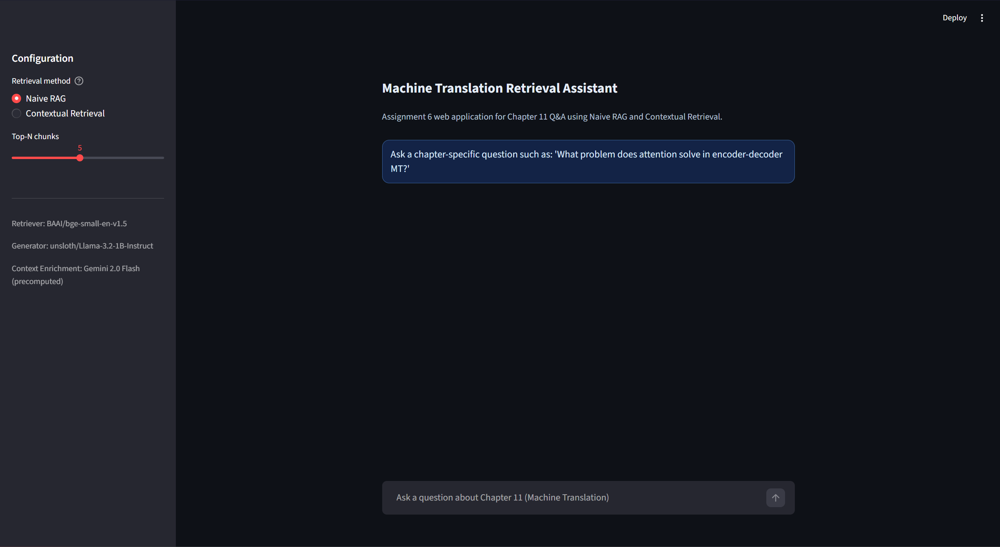
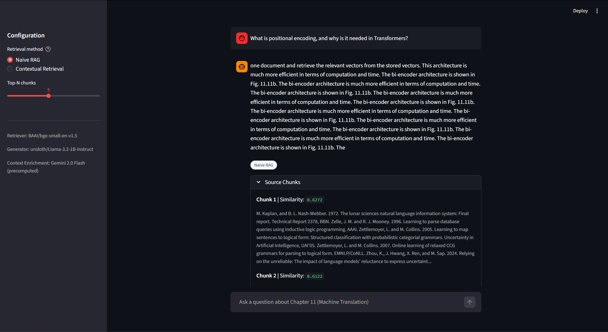
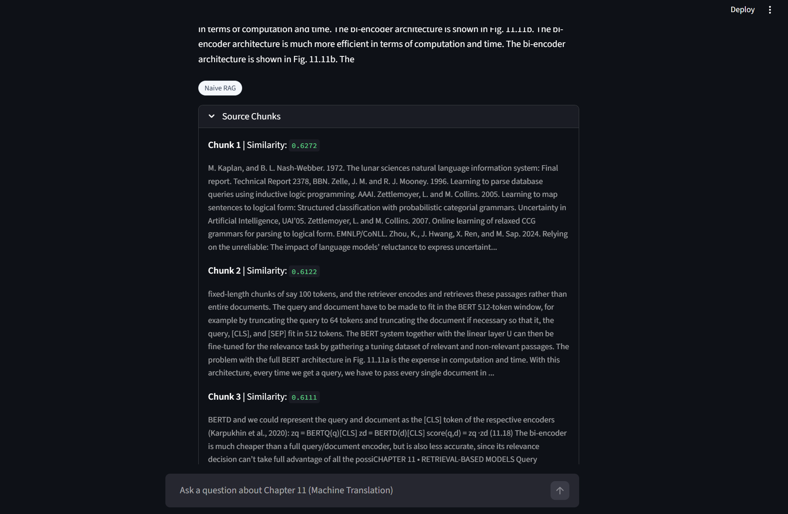
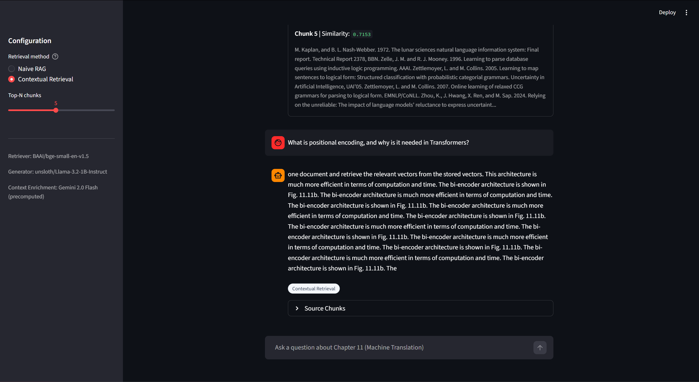

# NLU Assignment 6: Naive RAG vs Contextual Retrieval

Name: Muhammad Fahad Waqar 
Student No: st125981

## 1. Project Overview

Objective:
- Build a domain-specific QA system from the assigned chapter.
- Implement and compare two retrieval strategies:
  - Naive RAG
  - Contextual Retrieval
- Evaluate generated answers with ROUGE-1, ROUGE-2, and ROUGE-L.
- Make a web application using Contextual Retrieval for response generation.

## 2. Repository Structure

- `st125981_NLU_Assignment_6.ipynb`: Main notebook with all tasks and outputs.
- `app/app.py`: Professional Streamlit chatbot interface.
- `datasets/chapter11.txt`: Cleaned chapter text extracted from source PDF.
- `datasets/enriched_chunks.json`: Context-enriched chunks used by Contextual Retrieval.
- `answer/response-st125981-chapter-11.json`: Required 20-QA comparison artifact.
- `docs/screenshots/`: Placeholder location for submission screenshots.

## 3. Models and Components

Retriever stack:
- Embedding model: `BAAI/bge-small-en-v1.5`
- Similarity: cosine similarity

Generator stack:
- Generation model: `unsloth/Llama-3.2-1B-Instruct`

Contextual enrichment:
- LLM used during chunk enrichment: `gemini-2.0-flash`
- Enrichment output cached in `datasets/enriched_chunks.json`

- Naive RAG pipeline implemented and executed.
- Contextual Retrieval pipeline implemented and executed.
- Both pipelines evaluated on the same 20 QA set.
- ROUGE comparison produced:

| Method | ROUGE-1 | ROUGE-2 | ROUGE-L |
|---|---:|---:|---:|
| Naive RAG | 0.0721 | 0.0068 | 0.0640 |
| Contextual Retrieval | 0.0721 | 0.0068 | 0.0640 |

## 4. Web Application
1. Home / initial app state

Shows the default landing view with retrieval controls in the sidebar and the main prompt area before any question is asked.

2. Question and generated answer

Demonstrates a complete interaction where a user question is answered using retrieved chapter context.

3. Source chunk citation panel

Highlights the expandable citation panel that lists retrieved chunks and similarity scores for transparency.

4. Retrieval mode comparison (Naive vs Contextual)

Illustrates how the interface supports switching between Naive RAG and Contextual Retrieval modes.

## 5. Limitations

- The local generator (`Llama-3.2-1B-Instruct`) may produce unstable or partially irrelevant answers for some prompts.
- Answer quality is sensitive to chunk size and retrieval depth (`top_n`).
- Contextual enrichment quality depends on precomputed chunk contexts.

## 6. Conclusion
- GitHub repository link: `https://github.com/mfahadwaqar/st125981-NLU-Assignment-6`
- Jupyter notebook included: `st125981_NLU_Assignment_6.ipynb`
- README included: `README.md`
- Web application folder included: `app/`
- Required comparison JSON included: `answer/response-st125981-chapter-11.json`

Student and chapter naming alignment:
- Student ID: `st125981`
- Chapter used: `11`
- JSON naming convention followed: `response-st125981-chapter-11.json`
